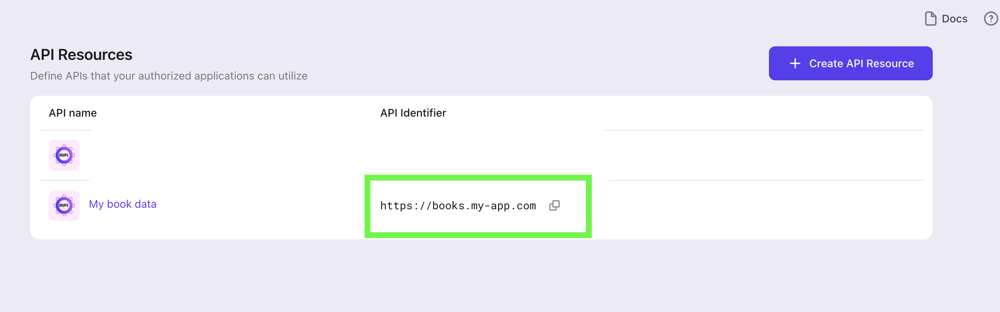

With the user's authorization status, a [JWT](https://datatracker.ietf.org/doc/html/rfc7519) format `access_token` will be granted and issued by Logto, specifically for the requested API resource. Encrypted and audience-restricted with an expiration time. The token carries all the necessary info to represent the authority of this request.

:::caution

If no resource is indicated, the `getAccessToken` will return an Opaque typed token instead of a JWT; something like

```json
{
  "access_token": "34536yrgbfe435gt_drerthb3r4thwgegrg", <- this is not a JWT
  "expires_in": 3600,
  "id_token": "...",
  "refresh_token": "...",
  "scope": "...",
  "token_type": "Bearer"
}
```

The resource should equal to something like the following in green box



:::

Put the token in the `Authorization` field of HTTP headers with the Bearer format (`Bearer YOUR_TOKEN`), and you are good to go.

:::note
The Bearer Token's integration flow may vary based on the framework or requester you are using. Choose your own way to apply the request `Authorization` header.
:::
